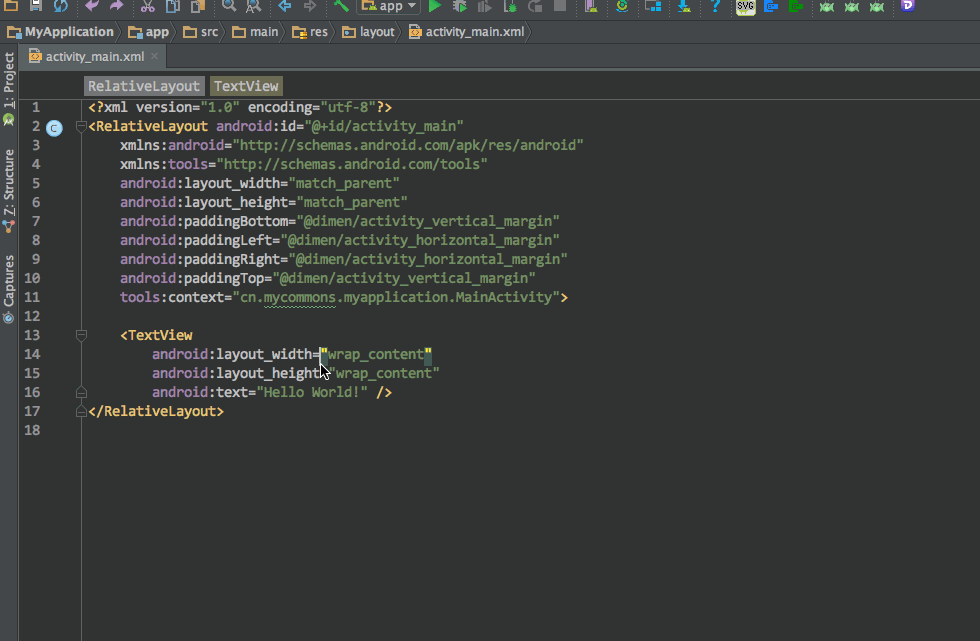

# Databinding Convert

---

# 简介

一个简单的Android Studio 插件，把当前的布局文件转化成Databinding的形式。

如，当一个布局文件如下所示:

```xml
<?xml version="1.0" encoding="utf-8"?>
<LinearLayout
        xmlns:android="http://schemas.android.com/apk/res/android"
        xmlns:tools="http://schemas.android.com/tools"
        android:layout_width="match_parent"
        android:layout_height="match_parent"
        android:orientation="vertical">

    <android.support.design.widget.TabLayout
            android:id="@+id/tabLayout"
            style="@style/tabLayoutStyle"
            android:layout_width="match_parent"
            android:layout_height="40dp"
            android:background="@color/colorPrimary"/>

    <android.support.v4.view.ViewPager
            android:id="@+id/vpMainContainer"
            android:layout_width="match_parent"
            android:layout_height="match_parent"/>
</LinearLayout>
```

转化过就是这样(注意：还没有实现代码转化后的格式化，需要手动格式化)：

```xml
<?xml version="1.0" encoding="UTF-8" standalone="no"?>
<layout xmlns:android="http://schemas.android.com/apk/res/android"
    xmlns:tools="http://schemas.android.com/tools">

    <data>

        <import type="" />

        <variable
            name=""
            type="" />
    </data>

    <LinearLayout
        android:layout_width="match_parent"
        android:layout_height="match_parent"
        android:orientation="vertical">

        <android.support.design.widget.TabLayout
            android:id="@+id/tabLayout"
            style="@style/tabLayoutStyle"
            android:layout_width="match_parent"
            android:layout_height="40dp"
            android:background="@color/colorPrimary" />

        <android.support.v4.view.ViewPager
            android:id="@+id/vpMainContainer"
            android:layout_width="match_parent"
            android:layout_height="match_parent" />
    </LinearLayout>
</layout>
```

# 操作示范



# 插件下载

[DatabindingConvert_v0.0.1.jar](https://github.com/LiushuiXiaoxia/DatabindingConvert/blob/master/DatabindingConvert_v0.0.1.jar?raw=true)

# 后续优化

* 布局代码转换后，自动格式化代码
* 创建带模板的Databinding文件

# 版本更新

* v0.0.2 简单的格式化代码

* v0.0.1 完成基本的布局转换